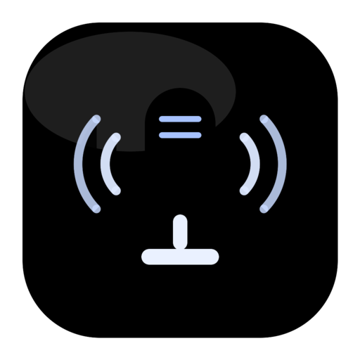

<div align="center">



# Whisper Transcriber

**Turn any audio or video file into text — entirely on your own machine.**

A small, native-feeling desktop app for [OpenAI Whisper](https://github.com/openai/whisper).
No account, no API key, no upload. Your media never leaves the device.

[](https://github.com/obywan-afk/transcriber-whisper/releases/download/latest-mac/WhisperTranscriber-mac-apple-silicon.dmg)
[](https://github.com/obywan-afk/transcriber-whisper/releases/download/latest-mac/WhisperTranscriber-mac-intel.dmg)
[](https://github.com/obywan-afk/transcriber-whisper/releases/download/latest-windows/WhisperTranscriber-windows.zip)

[](https://github.com/obywan-afk/transcriber-whisper/actions/workflows/build-mac.yml)
[](https://github.com/obywan-afk/transcriber-whisper/actions/workflows/build-windows.yml)
[](https://www.python.org/)

</div>

---

## Why

Most transcription tools want an upload, a subscription, or both. This one runs
Whisper locally: you pick a file, pick a model, and get a `.txt` back. Interviews,
lecture recordings, voice memos, and anything else you would rather not hand to a
cloud service stay on your disk.

## What it does

- **Transcribes** `mp3`, `wav`, `m4a`, `ogg`, `flac`, `mp4`, `webm`, `mkv`, `avi`, `mov`
- **Translates** to English in one pass, from 14 languages or auto-detect
- **Five model sizes** — trade speed for accuracy as the job demands
- **Optional timestamps** for subtitle-style output
- **Fully offline** after the first model download
- **FFmpeg included** — nothing to install separately

Models are fetched once on first use and cached in your home directory.

---

## Download

| Platform | File | For |
|---|---|---|
| **macOS** | **[WhisperTranscriber-mac-apple-silicon.dmg](https://github.com/obywan-afk/transcriber-whisper/releases/download/latest-mac/WhisperTranscriber-mac-apple-silicon.dmg)** | M1 or newer |
| **macOS** | **[WhisperTranscriber-mac-intel.dmg](https://github.com/obywan-afk/transcriber-whisper/releases/download/latest-mac/WhisperTranscriber-mac-intel.dmg)** | Intel Macs |
| **Windows** | **[WhisperTranscriber-windows.zip](https://github.com/obywan-afk/transcriber-whisper/releases/download/latest-windows/WhisperTranscriber-windows.zip)** | 64-bit Windows 10 or later |

These links always point at the newest build. Every release lists a SHA-256
checksum, and older builds live on the [releases page](https://github.com/obywan-afk/transcriber-whisper/releases).

> **Which Mac do I have?** Apple menu → **About This Mac**. A **Chip** line
> starting with *Apple* means Apple Silicon. A **Processor** line naming *Intel*
> means Intel. Downloading the wrong one gives you *"not supported on this
> Mac"* — the two builds are not interchangeable.

### Installing on macOS

1. Open the `.dmg` and drag **WhisperTranscriber** onto **Applications**.
2. Launch it from Applications.

If macOS says the app *"cannot be opened because Apple cannot check it for
malicious software"*, the build is signed but not yet notarized. **Right-click**
the app and choose **Open**, then confirm. Once only — after that it launches
normally.

<details>
<summary>Prefer the terminal?</summary>

```bash
xattr -dr com.apple.quarantine /Applications/WhisperTranscriber.app
```

</details>

### Installing on Windows

1. Unzip the download anywhere you like — your user folder is fine.
2. Run **`WhisperTranscriber.exe`** from inside the unzipped folder.

The build is unsigned, so SmartScreen shows a blue *"Windows protected your PC"*
banner on first launch. Click **More info**, then **Run anyway**. Once only.

> Keep the whole folder together. The `.exe` needs the files beside it.

---

## Using it

1. **Choose a file** — click the file zone to browse.
2. **Pick a model** — see the table below.

3. **Set the language** — auto-detect, or pin one of 14 for better accuracy.
4. **Transcribe or translate** — translation always outputs English.
5. **Choose plain text or timestamps**, then **Save** as `.txt`.

### Choosing a model

Bigger models are more accurate and slower. Times are rough, for one hour of
audio on Apple Silicon; a machine without a GPU will be slower.

| Model | Download | Relative cost | Quality | Good for |
|---|---|---|---|---|
| `tiny` | 39 MB | ~1× | Basic | Quick drafts |
| `base` | 74 MB | ~3× | Good | **Everyday use — the default** |
| `small` | 244 MB | ~6× | Better | Accurate work |
| `medium` | 769 MB | ~18× | Great | Accents, background noise |
| `large` | 1.5 GB | ~32× | Best | Hardest audio, best quality |

The app opens on `base`. Move up only if the output disappoints — `large` costs
roughly 32× the compute of `tiny` for the same file.

### Where things live

| What | macOS | Windows |
|---|---|---|
| Logs | `~/.whisper_transcriber/` | `%USERPROFILE%\.whisper_transcriber\` |
| Model cache | `~/.cache/whisper/` | `%USERPROFILE%\.cache\whisper\` |

Deleting the model cache is safe — models re-download on next use.

---

## Run from source

Works anywhere Python does, Linux included.

```bash
git clone https://github.com/obywan-afk/transcriber-whisper.git
cd transcriber-whisper
pip install openai-whisper imageio-ffmpeg numpy
```

Then start the interface for your platform:

```bash
python transcriber_mac.py       # macOS
python transcriber_windows.py   # Windows
```

Python 3.11 is what CI builds against.

## Building it yourself

```bash
pip install pyinstaller

# macOS
pyinstaller --noconfirm --windowed --name WhisperTranscriber \
  --icon assets/icon.icns \
  --collect-all whisper --collect-all imageio_ffmpeg \
  transcriber_mac.py

# Windows
pyinstaller --noconfirm --windowed --name WhisperTranscriber \
  --icon assets/icon.ico \
  --collect-all whisper --collect-all imageio_ffmpeg \
  transcriber_windows.py
```

Output lands in `dist/`.

### How releases are made

Every push to `main` rebuilds both apps and refreshes the rolling `latest-mac`
and `latest-windows` releases, so the download links above are never stale.
Pushing a `v*` tag publishes a numbered release with both files attached.

The macOS build is signed with a Developer ID certificate and submitted to
Apple's notary service. When notarization succeeds the DMG is stapled and opens
with no warning; when it cannot (an expired Apple agreement, say) the build
still ships, signed but un-notarized, and the release notes say so. The Windows
build is currently unsigned.

---

## Project layout

```
transcriber_mac.py            macOS interface
transcriber_windows.py        Windows interface
assets/                       Icon source and exported .icns / .ico
.github/workflows/
  build-mac.yml               Signed, notarized DMG
  build-windows.yml           Zipped Windows build
```

See [`assets/README.md`](assets/README.md) for regenerating the icons.

## Troubleshooting

<details>
<summary><b>macOS: "the application cannot be opened"</b></summary>

The build is not notarized. Right-click the app in Applications and choose
**Open**, then confirm. See [Installing on macOS](#installing-on-macos).

</details>

<details>
<summary><b>macOS: "not supported on this Mac"</b></summary>

Wrong architecture — an Apple Silicon build on an Intel Mac or the reverse.
Rosetta cannot help here; it translates Intel code to run on Apple Silicon, not
the other way round. Check which you need:

```bash
uname -m   # arm64  -> WhisperTranscriber-mac-apple-silicon.dmg
           # x86_64 -> WhisperTranscriber-mac-intel.dmg
```

</details>

<details>
<summary><b>Windows: SmartScreen blocks the app</b></summary>

Expected — the build is unsigned. Click **More info**, then **Run anyway**.

</details>

<details>
<summary><b>The first transcription hangs for ages</b></summary>

It is downloading the model, which for `large` is 3 GB. Later runs use the
cache and start immediately. Progress is written to the log file listed under
[Where things live](#where-things-live).

</details>

<details>
<summary><b>Something else went wrong</b></summary>

Check the log in `~/.whisper_transcriber/`, then
[open an issue](https://github.com/obywan-afk/transcriber-whisper/issues) with
the relevant lines.

</details>

---

<div align="center">

Built on [OpenAI Whisper](https://github.com/openai/whisper) · Bundled FFmpeg via [imageio-ffmpeg](https://github.com/imageio/imageio-ffmpeg)

</div>
